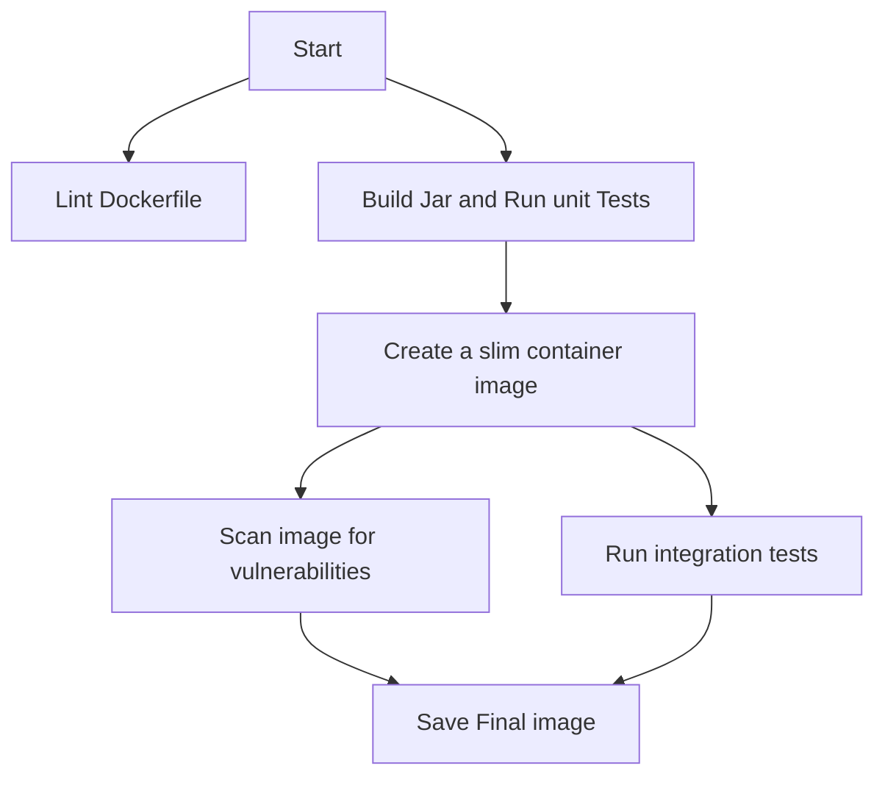

# An example spring-boot application

Local setup
```shell
APP_VERSION=1.0.0
docker build --build-arg APP_VERSION=${APP_VERSION} -t spring-demo:${APP_VERSION} .
docker run --rm -d -p 8081:8081 --name spring-demo spring-demo:${APP_VERSION}
curl http://localhost:8081
docker rm -f spring-demo
```

Docker multistage build



