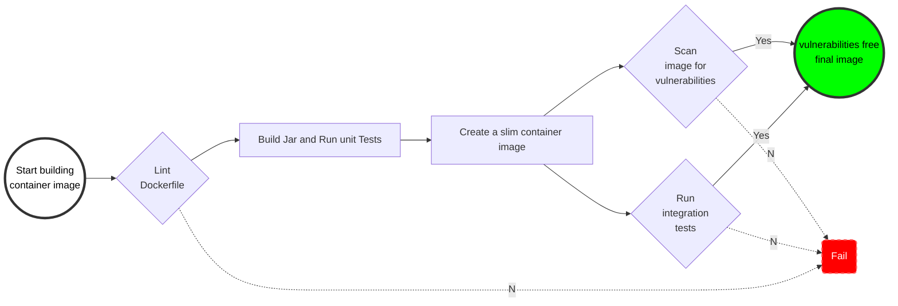

# An example spring-boot application

* A [Spring-boot Java project](https://spring.io/projects/spring-boot)
* Dockerfile, Containers images will be scanned using [Trivy](https://aquasecurity.github.io/trivy/).
* Containers Integration using Docker [multi-stage build](), [GitHub Actions](), [ArgoCD]().

## Local setup
```shell
git clone --recursive https://github.com/KondaReddyR/spring-demo.git
cd spring-demo

APP_VERSION=1.0.0
docker build --build-arg APP_VERSION=${APP_VERSION} -t spring-demo:${APP_VERSION} .
docker run --rm -d -p 8081:8081 --name spring-demo spring-demo:${APP_VERSION}
curl http://localhost:8081
docker rm -f spring-demo
```

## Docker multistage build



Running in Kubernetes

```shell
helm upgrade --install spring-demo ./spring-demo-iac/spring-demo --set image.tag=1.0.2
kubectl port-forward service/spring-demo 8081:8081
curl http://localhost:8081
```